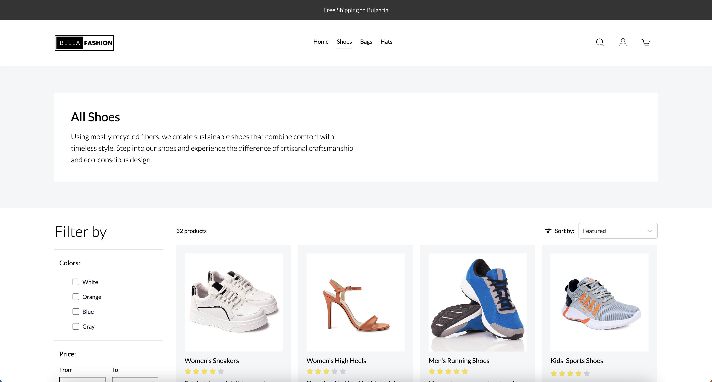
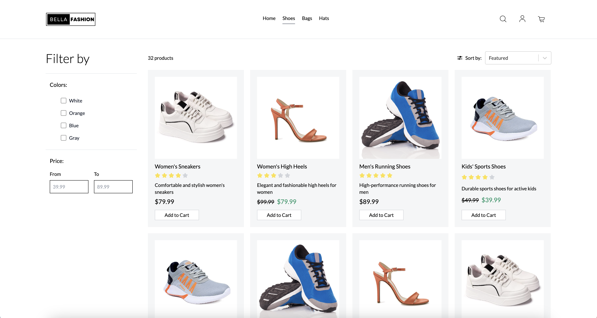
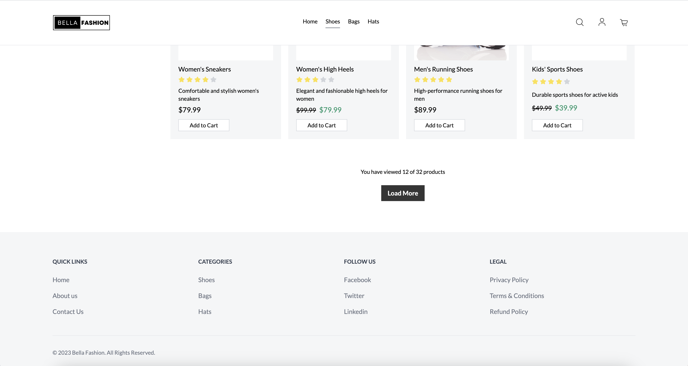
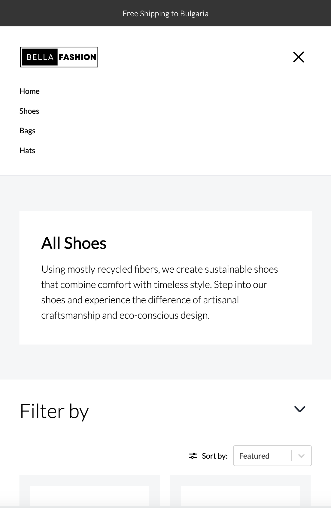

# C4 Nexus Ecommerce Site

This is a C4 Nexus technical interview task for an ecommerce product listing page. The project was built using Vite React and Tailwind CSS.

## Features

All requirements from the task were successfully implemented.

The features are:

-   [x] Responsive design
-   [x] Sticky header with a logo and a simple navigation menu
-   [x] 3 product listing category pages (Shoes, Bag and Hats)
-   [x] Category section with title and description
-   [x] Product grid that loads 4 x 3 rows of products from a JSON file
-   [x] Product tile with an image, name, short description, price, discounted prices, rating and add to cart button with success alert
-   [x] Load more button with a onClick listener that renders 3 rows of additional products
-   [x] Alphabetical filtering (A-Z and Z-A) and price sorting (ascending and descending) mechanism
-   [x] X out of Y product counter
-   [x] Static footer containing a set of links

Additional features

-   [x] Announcement bar at the top of the page
-   [x] Lazy loading of images

## Implementation

### Structure

The main structure for the application is laid out inside App.jsx. This file imports the AnnouncementBar, Header, ProductGrid, Footer, and CategoryDescription components, as well as storing the routes for the different pages/categories.

### Category Navigation

Inside App.jsx, React Router was used to enable the navigation between the different category pages. Each route passes in the CategoryDescription (with a title and desc prop) and ProductGrid (with a category prop) component as a route element.

The title and desc prop are used to pass data to the CategoryDescription component that displays the title and description of each category.

The category prop is used to tell the ProductGrid component which category to filter from the imported products.json file by calling the getCategoryProducts() function. If no category prop is passed, getCategoryProducts() will get all the product items from the JSON file - this can be seen on the home page.

### Product Grid

The ProductGrid component is in charge of handling and displaying the product grid. This component imports the ProductSorting, ProductFiltering, AddToCartButton, ProductCounter, and StarRatings components.

The main functionality of the ProductGrid component is to map through the paginated filtered/sorted product object to render the product's image, title, star rating, price, discounted price (if it exists), and add to cart button. Each image uses lazy loading by using the NPM LazyLoadImage package and is stored in the public directory.

The AddToCartButton component uses the NPM package react-toastify with an onClick listener to display a success alert with the product's name on click.

CSS flexbox (with flex-direction: row and flex-wrap) was used to structure the layout of the products. A max-width property with a percentage value was used to ensure the grid scales. Media queries was then used to collapse the grid for smaller devices depending on the width.

To improve the application's modularity the LoadMore button could perhaps be split up into an extra component.

### CSS Styling and Responsiveness

Most of the CSS styling and design responsiveness was done by using Tailwind CSS. Inside of styles.css additional styling and some extra media queries can be found to help make the product grid responsive and to override styles from NPM imports react-toastify and LazyLoadImage.

## Challenges

The most challenging part was to implement the sorting and filtering mechanises and enable them to work together.

This was achieved by separating the sorting and filtering functionalities into separate components (ProductFiltering and ProductSorting) and passing them two props (getCategoryProducts(), setFilteredProducts/setSortedProducts). After the user selects the desired options, onChange event listeners call functions that sort or filter the products object received from getCategoryProducts(). Once sorted/filtered and validated (if required), it returns the state back to the ProductGrid component by setting setSortedProducts or setFilteredProducts.

A useEffect hook inside ProductGrid then calls orderProducts() to further validate the returned objects and to set the products state with setProducts.

Before rendering the items to the product grid, getPaginatedData() is called which uses the slice() method to return the paginated data depending on the pageCount. The returned object, with the correct order and filtered items, is then mapped to the product grid.

## Screenshots

<!-- Desktop screenshots -->




<!-- Mobile screenshots -->




## Installation

```bash
# Clone this repository
$ git clone https://github.com/MatthewBleUK/c4-nexus-react-ecommerce-assignment.git

# Go into the repository
$ cd c4-nexus-react-ecommerce-assignment

# Install dependencies
$ npm install

# Run the app
$ npm run dev
```

## License

This project is released under the GNU General Public License v3.
